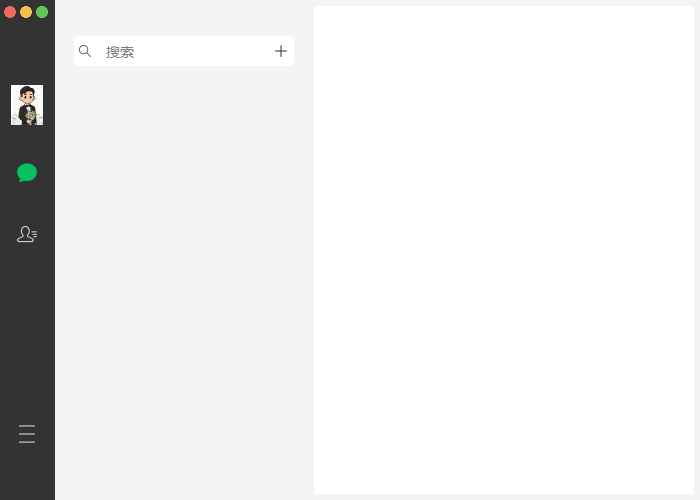
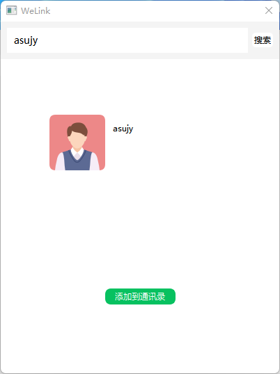
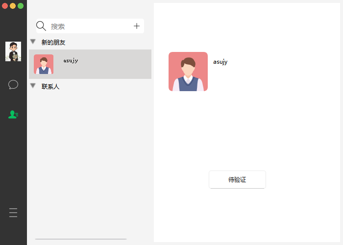
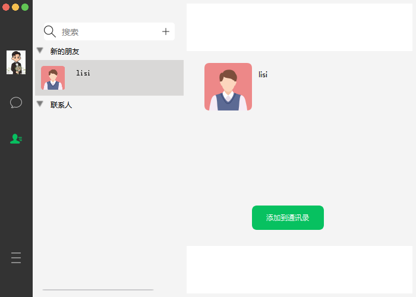
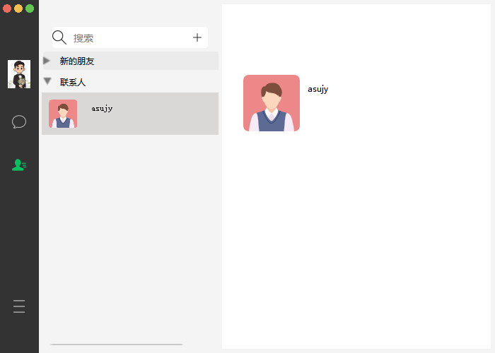
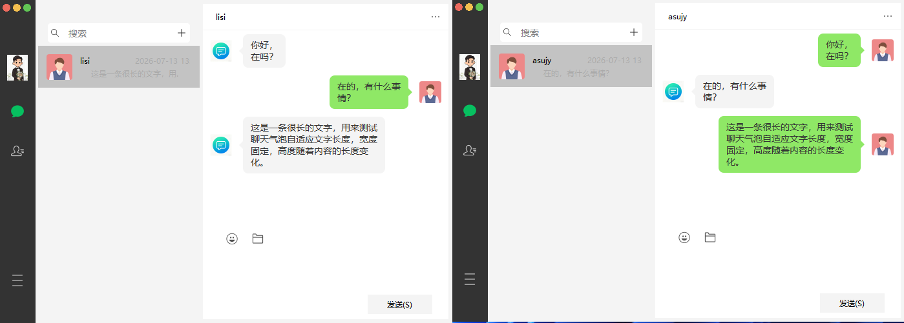

# WeLink
基于 C++ / Qt 开发的桌面即时通讯客户端  

 

# 快速开始
&nbsp;&nbsp;&nbsp;&nbsp;下载项目中的 `WeLink-Window64.zip`，解压之后直接点击执行WeLink.exe，进行登录注册。  

 

# 模块说明
|    模块名称     |                     模块用途                      |
|:-----------:|:---------------------------------------------:|
|  app   |                 程序入口 + 业务调度中枢，串联网络、数据库、界面三大模块，处理登录、聊天整体业务逻辑。                  |
|     DBMagr      |                     统一封装所有 SQLite 数据库操作，隔离业务代码与原生 QtSql API，提供对数据的增删改查，全局单例调用。                     |
|     common     | 全局常量、通用工具函数、基础封装 |
|   model   |        定义项目所有数据实体结构体，统一数据格式                           |
| net |                    封装 Qt TcpSocket，实现客户端与 IM 服务端双向通信，负责消息收发、字节流处理。                    |
|    ui_components    |               全部界面组件，自定义 UI 控件：气泡、输入框、窗口等                |

# 功能展示

